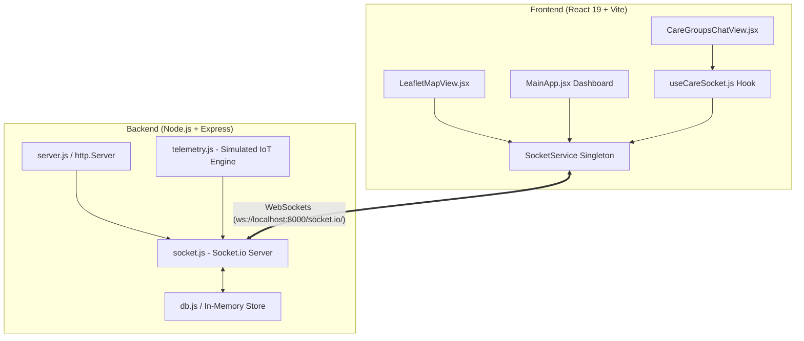

# 📡 Arquitetura de Mensageria em Tempo Real — Betterdays

Este documento descreve detalhadamente a arquitetura de **mensageria em tempo real e telemetria** do ecossistema **Betterdays**, baseada em **Socket.io (WebSockets)** conectando o frontend React ao backend Node.js.

---

## 1. Visão Geral da Arquitetura

O sistema atende simultaneamente a duas necessidades vitais:
1. **Comunicação Humana (Grupos de Cuidado estilo WhatsApp):** Conversas em tempo real entre familiares, médicos especialistas (InCor/HC-FMUSP), cuidadores e fornecedores de oxigenioterapia/farmácia.
2. **Telemetria Crítica e Emergências (IoT & SOS):** Disparo de localização em caso de crise, desvio de cerca virtual (Geofence) e transmissão contínua de pulso satelital com baixa latência (<20ms).



---

## 2. Dicionário de Eventos WebSocket

### 2.1 Eventos de Chat e Grupos de Cuidado

| Evento | Direção | Payload | Descrição |
| :--- | :--- | :--- | :--- |
| `join_group` | Client ➔ Server | `{ groupId: string }` | Registra o socket na sala (`group:${groupId}`) |
| `leave_group` | Client ➔ Server | `{ groupId: string }` | Remove o socket da sala do grupo |
| `send_message` | Client ➔ Server | `{ groupId, text, sender, senderRole, avatar, isSystem, type, ... }` | Envia mensagem com callback ACK de entrega imediata |
| `receive_message` | Server ➔ Client | `{ groupId, message: MessageObject }` | Broadcast em tempo real para todos os participantes do grupo |
| `typing_status` | Client ➔ Server | `{ groupId, user, isTyping: boolean }` | Notifica início/fim de digitação pelo usuário |
| `user_typing` | Server ➔ Client | `{ groupId, user, isTyping: boolean }` | Notifica outros participantes da sala que alguém está digitando |
| `mark_as_read` | Client ➔ Server | `{ groupId, messageIds: string[] }` | Atualiza status das mensagens para lido (`read`) |
| `messages_marked_read`| Server ➔ Client | `{ groupId, messageIds: string[] }` | Notifica todos na sala que mensagens foram visualizadas (`✓✓`) |

### 2.2 Eventos de Telemetria e Emergência SOS

| Evento | Direção | Payload | Descrição |
| :--- | :--- | :--- | :--- |
| `sos_trigger` | Client ➔ Server | `{ patient, location, sender, details }` | Dispara protocolo de emergência imediato |
| `sos_alert` | Server ➔ Client | `{ id, patient, location, timestamp, details }` | **Broadcast Global** para todos os cuidadores e cria card na Central SOS (`grp-3`) |
| `telemetry_pulse` | Server ➔ Client | `{ deviceId, lat, lng, battery, timestamp }` | Pulso periódico de GPS e bateria para mapa e dashboard |

---

## 3. Estrutura dos Payloads

### 3.1 Mensagem de Texto Padrão
```json
{
  "id": "msg-1725567890123-456",
  "sender": "Você",
  "senderRole": "Cuidador Principal",
  "avatar": "DU",
  "text": "Mariana descansou bem e tomou a medicação matinal.",
  "timestamp": "08:42",
  "isMe": true,
  "status": "sent"
}
```

### 3.2 Card de Telemetria GPS Compartilhado no Chat
```json
{
  "id": "msg-1725567890999-789",
  "sender": "Sistema Tracker",
  "senderRole": "Telemetria Satelital",
  "isSystem": true,
  "type": "gps_card",
  "locationName": "Residência Familiar (Zona Segura)",
  "coordinates": "-23.5614, -46.6560",
  "battery": "87%",
  "timestamp": "10:05"
}
```

### 3.3 Card de Alerta Crítico SOS
```json
{
  "id": "sos-1725567891234",
  "patient": "Mariana Silva",
  "location": "-23.5614, -46.6560",
  "timestamp": "10:14",
  "details": "Protocolo de resgate satelital acionado pelo cuidador via chat."
}
```

---

## 4. Integração no React (`useCareSocket` Hook)

O hook `useCareSocket` encapsula todo o ciclo de vida do WebSocket, isolando a complexidade do React e garantindo re-renderizações otimizadas:

```jsx
import React from 'react';
import useCareSocket from '../hooks/useCareSocket';

export default function ChatExample() {
  const {
    isConnected,
    groups,
    typingUsers,
    joinGroup,
    sendMessage,
    sendTypingStatus,
    triggerSos,
  } = useCareSocket();

  return (
    <div>
      <div className={`status ${isConnected ? 'online' : 'connecting'}`}>
        {isConnected ? '🟢 Ao Vivo via WebSocket' : '🟡 Reconectando...'}
      </div>
      {/* Feed de mensagens e input sincronizados em tempo real */}
    </div>
  );
}
```

---

## 5. Estratégia de Resiliência e Reconexão

1. **Auto-Reconexão com Exponential Backoff:**
   - Tentativas: 10 tentativas com atrasos progressivos (1s até 5s máx).
2. **Fallback Gracioso para Polling HTTP:**
   - O `MainApp.jsx` mantém um polling leve de contingência a cada 15 segundos caso o socket perca conectividade em redes móveis instáveis.
3. **Indicador Visual de Conexão:**
   - Badge `🟢 Ao Vivo` / `🟡 Conectando` no topo da sidebar de conversas para total transparência ao cuidador.
