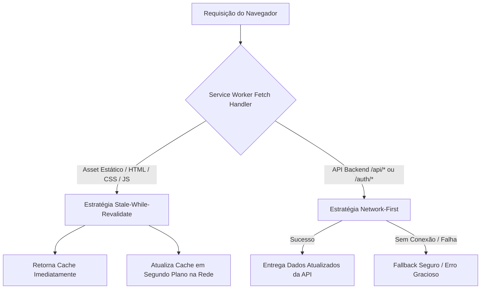

# 📱 Betterdays PWA (Progressive Web App)

Documentação técnica completa sobre a arquitetura, funcionamento e instalação do **PWA (Progressive Web App)** no sistema **Betterdays**.

---

## 🧭 Visão Geral

O Betterdays foi transformado em um **Progressive Web App** completo, permitindo que a aplicação seja instalada e executada como um aplicativo nativo tanto no **Desktop** (Windows, macOS, Linux) quanto no **Celular/Tablet** (Android, iOS/iPadOS), sem a necessidade de publicação em lojas de aplicativos e consumindo uma fração da memória de apps baseados em Electron.

### Principais Benefícios:
* 🚀 **Janela Standalone & Sem Barra do Navegador:** Experiência 100% imersiva de software nativo.
* ⚡ **Carregamento Instantâneo & Cache Inteligente:** Service Worker com estratégia *Stale-While-Revalidate* para assets estáticos e suporte offline resiliente.
* 📲 **Multiplataforma:** Suporte total a desktop, Android (WebAPK/Chrome) e iOS (Safari Standalone).
* 🎯 **Atalhos Rápidos de App (Shortcuts):** Acesso direto com toque longo/clique com botão direito para *Mapa*, *Rastreadores* e *Monitoramento Interno*.
* 🎨 **Integração Visual com o Sistema Operacional:** Cores de barra de status personalizadas (`#0D9488` / `#F8FAFC`).

---

## 🏗️ Arquitetura e Estrutura Técnica

A implementação foi desenvolvida de forma **nativa e modular** sobre o ecossistema **Vite + React**, sem bibliotecas pesadas de terceiros.

```
frontend/
├── public/
│   ├── manifest.json       # Manifesto PWA (metadados, atalhos, tema, display)
│   ├── sw.js               # Service Worker (ciclo de vida, cache e interceptação)
│   └── icons/              # Ícones em múltiplas resoluções (16, 32, 180, 192, 512, maskable)
├── index.html              # Meta tags para Apple iOS, Android e link do manifesto
└── src/
    ├── main.jsx            # Registro e bootstrap seguro do Service Worker
    └── components/
        └── UserAvatarMenu.jsx # Hook React com captura do evento 'beforeinstallprompt'
```

---

## 📄 1. Manifesto da Aplicação (`manifest.json`)

Localizado em [`frontend/public/manifest.json`](file:///Users/vagneribas/Documents/GitHub/tracker_system/frontend/public/manifest.json), define a identidade e o comportamento do aplicativo perante o sistema operacional:

```json
{
  "name": "Betterdays - Telemetria & Monitoramento Contínuo",
  "short_name": "Betterdays",
  "start_url": "/",
  "scope": "/",
  "display": "standalone",
  "display_override": ["window-controls-overlay", "standalone", "minimal-ui", "browser"],
  "orientation": "portrait-primary",
  "theme_color": "#0D9488",
  "background_color": "#F8FAFC",
  "icons": [
    { "src": "/icons/icon-192.png", "sizes": "192x192", "type": "image/png", "purpose": "any" },
    { "src": "/icons/icon-192.png", "sizes": "192x192", "type": "image/png", "purpose": "maskable" },
    { "src": "/icons/icon-512.png", "sizes": "512x512", "type": "image/png", "purpose": "any" },
    { "src": "/icons/icon-512.png", "sizes": "512x512", "type": "image/png", "purpose": "maskable" }
  ],
  "shortcuts": [
    { "name": "Mapa Satelital", "url": "/#map", "description": "Abrir mapa de rastreamento" },
    { "name": "Rastreadores", "url": "/#trackers", "description": "Gerenciar dispositivos e pareamento" },
    { "name": "Monitoramento Interno", "url": "/#indoor", "description": "Planta baixa dos cômodos" }
  ]
}
```

* **`display: "standalone"`:** Abre a aplicação em sua própria janela independente, ocultando a barra de URLs.
* **`purpose: "maskable"`:** Garante que no Android os ícones se adaptem a qualquer formato (círculo, esquilo, quadrado arredondado) sem bordas brancas indesejadas.
* **`shortcuts`:** Habilita o menu de contexto rápido no ícone do aplicativo.

---

## ⚙️ 2. Service Worker (`sw.js`) e Estratégia de Cache

O Service Worker ([`frontend/public/sw.js`](file:///Users/vagneribas/Documents/GitHub/tracker_system/frontend/public/sw.js)) atua como um proxy de rede transparente:



### Ciclo de Vida:
1. **`install`:** Realiza o pré-cache dos arquivos essenciais (HTML base, CSS, fontes, ícones). Usa `self.skipWaiting()` para ativação imediata.
2. **`activate`:** Itera pelos caches antigos e remove versões obsoletas (`betterdays-pwa-v1`), assumindo o controle com `clients.claim()`.
3. **`fetch`:** Roteia as requisições aplicando a estratégia correta para dados dinâmicos vs. arquivos de layout.

---

## ⚛️ 3. Integração com React e Eventos do Navegador

### Registro no Bootstrap (`main.jsx`)
O Service Worker é inicializado assincronamente assim que o React monta a aplicação no DOM:

```javascript
if ('serviceWorker' in navigator && (window.location.protocol === 'https:' || window.location.hostname === 'localhost')) {
  window.addEventListener('load', () => {
    navigator.serviceWorker.register('/sw.js')
      .then(reg => console.log('✅ PWA Service Worker ativo!', reg.scope))
      .catch(err => console.warn('PWA SW registro falhou:', err));
  });
}
```

### Botão de Instalação no Menu do Avatar (`UserAvatarMenu.jsx`)
O componente escuta o evento global `beforeinstallprompt`:

```javascript
// 1. Escuta o evento nativo
useEffect(() => {
  const handler = (e) => {
    e.preventDefault();
    setInstallPrompt(e);
  };
  window.addEventListener('beforeinstallprompt', handler);
  return () => window.removeEventListener('beforeinstallprompt', handler);
}, []);

// 2. Dispara a instalação sob demanda
const handleInstallPwa = async () => {
  if (installPrompt) {
    installPrompt.prompt();
    const { outcome } = await installPrompt.userChoice;
    if (outcome === 'accepted') setInstallPrompt(null);
  } else if (/iPhone|iPad|iPod/.test(navigator.userAgent)) {
    // Guia customizado para Safari no iOS
    alert("Para instalar no iOS: toque no botão Compartilhar ⎋ e selecione 'Adicionar à Tela de Início ⊞'.");
  }
};
```

---

## ⚡ 4. Recursos Avançados de PWA

### 📶 Indicador Visual de Conexão Offline / Online
* **Hook:** [`useNetworkStatus.js`](file:///Users/vagneribas/Documents/GitHub/tracker_system/frontend/src/hooks/useNetworkStatus.js)
* **Componente:** [`NetworkStatusBar.jsx`](file:///Users/vagneribas/Documents/GitHub/tracker_system/frontend/src/components/NetworkStatusBar.jsx)
* **Comportamento:** Ao desconectar da internet, uma barra suave e destacada surge no topo informando o estado offline e a exibição de dados locais do cache. Ao reconectar, a barra exibe confirmação em verde por 4 segundos e sincroniza automaticamente.

### 🔔 Notificações Nativas do Sistema Operacional (OS / Desktop / Mobile)
* **Serviço:** [`notificationService.js`](file:///Users/vagneribas/Documents/GitHub/tracker_system/frontend/src/services/notificationService.js)
* **Handlers no Service Worker:** Eventos `notificationclick` (que foca na janela e navega para `/#map` ou `/#messages`) e `push`.
* **Gatilhos Automáticos:** Disparado em emergências de **SOS Global** e mensagens prioritárias.

### 🖼️ Vitrine Visual de Instalação (Rich Install Screenshots)
* O manifesto inclui capturas em proporções `wide` (1280x720) e `narrow` (540x960), ativando o instalador visual rico em navegadores compatíveis (Chrome Desktop e Android).

---

## 💻 Como Instalar e Testar

### 1. No Desktop (Windows / macOS / Linux)
* **Google Chrome / Microsoft Edge / Brave:**
  1. Acesse `http://localhost:5173` ou o domínio em produção.
  2. Clique no ícone de **instalação (computadorzinho com seta)** na barra de navegação do navegador, ou abra o menu do seu Avatar no topo da página e clique em **"Instalar"**.
  3. O aplicativo será aberto em uma janela dedicada e fixado no Menu Iniciar / Dock.

### 2. No Celular Android
* **Google Chrome / Samsung Internet:**
  1. Acesse a aplicação no navegador mobile.
  2. Toque em **"Instalar"** no menu do avatar ou no banner inferior nativo.
  3. O ícone aparecerá na gaveta de aplicativos e na tela inicial com suporte a toque longo para atalhos rápidos.

### 3. No iPhone / iPad (iOS)
* **Safari:**
  1. Acesse a aplicação no Safari.
  2. Toque no botão de **Compartilhar** (ícone do quadrado com a seta para cima ⎋).
  3. Role a lista e selecione **"Adicionar à Tela de Início"** (⊞).
  4. O app será executado em modo *standalone*, com barra de status integrada.

---

## 🔍 Depuração e Validação no Chrome DevTools

Para inspecionar o status do PWA durante o desenvolvimento:
1. Pressione `F12` (ou `Cmd + Option + I` no Mac) e acesse a aba **Application** (Aplicativo).
2. **Manifest:** Valida nome, cores, ícones, orientação, atalhos e screenshots.
3. **Service Workers:** Permite testar modo offline (*Offline checkbox*), forçar atualização (*Update on reload*) e simular ciclo de vida.
4. **Storage / Cache Storage:** Visualiza todos os arquivos armazenados no cache `betterdays-cache-v4`.
