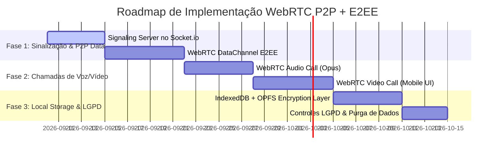

# 🔒 Arquitetura WebRTC P2P, E2EE, Armazenamento Local & Conformidade LGPD
**Betterdays — Comunicação Segura, Chamadas de Voz/Vídeo, Transferência Direta de Arquivos & Zero-Cloud Knowledge**

---

## 1. 🎯 Visão Geral e Objetivos Estratégicos

O objetivo desta arquitetura é transformar o módulo de comunicação do **Betterdays** em uma plataforma **P2P (Peer-to-Peer) descentralizada, de conhecimento zero pelo servidor (*Zero-Knowledge*) e focada em privacidade médica (*Privacy by Design*)**.

### Principais Pilares:
1. **Chamadas de Voz e Vídeo Diretas (WebRTC MediaStreams)**: Comunicação de baixa latência (<100ms) direta entre o smartphone do cuidador e o do familiar/médico, sem que o áudio/vídeo passe por servidores de mídia intermediários.
2. **Mensagens e Arquivos P2P (WebRTC DataChannels)**: Envio instantâneo de mensagens de texto, exames em PDF, fotos e laudos médicos direto de dispositivo para dispositivo.
3. **Armazenamento Local (*Local-First Architecture*)**: Nenhuma mensagem, gravação ou arquivo médico é armazenado no servidor backend. Todos os dados residem exclusivamente no armazenamento seguro do próprio celular do usuário (IndexedDB + OPFS com criptografia).
4. **Criptografia de Ponta a Ponta (E2EE)**:
   - **Mídia (Áudio/Vídeo)**: DTLS-SRTP nativo do WebRTC (AES-128-GCM / AES-256-GCM).
   - **Dados e Arquivos**: Troca de chaves assimétricas **ECDH (Curve25519)** + Criptografia simétrica **AES-256-GCM** via Web Crypto API nativa do navegador/PWA.
5. **Conformidade Total com a LGPD (Lei 13.709/2018)**: Mitigação máxima de risco regulatório, uma vez que dados sensíveis de saúde (Art. 11) não transitam em texto claro nem são persistidos em bancos de dados na nuvem.

---

## 2. 🏛️ Diagrama Arquitetural de Comunicação P2P

```
┌────────────────────────────────────────────────────────────────────────────────────────┐
│                                 SERVIDOR BACKEND BETTERDAYS                            │
│                              (Apenas Sinalização / Metadata)                          │
│                                                                                        │
│                 ┌────────────────────────────────────────────────────┐                 │
│                 │   Socket.io Signaling Server (SDP Offer / Answer   │                 │
│                 │          & ICE Candidates Exchange)                │                 │
│                 └──────────────┬──────────────────────┬──────────────┘                 │
└────────────────────────────────┼──────────────────────┼────────────────────────────────┘
                                 │ SDP / ICE            │ SDP / ICE
                                 │ (Sinalização)        │ (Sinalização)
                                 ▼                      ▼
               ┌───────────────────────────┐          ┌───────────────────────────┐
               │    SMARTPHONE CUIDADOR    │          │    SMARTPHONE MÉDICO      │
               │         (Peer A)          │          │         (Peer B)          │
               │                           │          │                           │
               │  ┌─────────────────────┐  │          │  ┌─────────────────────┐  │
               │  │  IndexedDB + OPFS   │  │          │  │  IndexedDB + OPFS   │  │
               │  │ (Criptografia Local)│  │          │  │ (Criptografia Local)│  │
               │  └─────────────────────┘  │          │  └─────────────────────┘  │
               └─────────────┬─────────────┘          └─────────────┬─────────────┘
                             │                                      │
                             │◄════════════════════════════════════►│
                             │     TÚNEL P2P DIRETO (WEBRTC)        │
                             │                                      │
                             │  1. WebRTC DataChannel (E2EE)        │
                             │     • Mensagens instantâneas         │
                             │     • Arquivos e Laudos (Chunks)     │
                             │                                      │
                             │  2. WebRTC MediaStream (DTLS-SRTP)   │
                             │     • Chamadas de Voz (Opus)         │
                             │     • Chamadas de Vídeo (VP8/H.264)  │
                             └──────────────────────────────────────┘
```

---

## 3. 🧩 Especificação dos Componentes WebRTC

### 3.1. Sinalização Leve sobre Socket.io Existente
O servidor Socket.io existente no projeto (`backend/src/socket.js`) continuará sendo o orquestrador de **Sinalização**, sem tocar no tráfego de dados pesados:

| Evento Socket.io | Direção | Payload | Descrição |
| :--- | :--- | :--- | :--- |
| `webrtc_call_initiate` | Client ➔ Server | `{ targetUserId, callType: 'audio'|'video', offerSDP }` | Inicia chamada P2P |
| `webrtc_call_incoming` | Server ➔ Client | `{ callerUserId, callerName, callType, offerSDP }` | Notifica destinatário |
| `webrtc_call_answer` | Client ➔ Server | `{ targetUserId, answerSDP }` | Resposta com SDP Answer |
| `webrtc_ice_candidate` | Bidirecional | `{ targetUserId, candidate }` | Troca de candidatos ICE |
| `webrtc_call_hangup` | Bidirecional | `{ targetUserId, reason }` | Encerramento da chamada |

### 3.2. Servidores STUN e TURN (Travessia de NAT/Firewall)
* **STUN (Session Traversal Utilities for NAT)**: Utiliza servidores públicos gratuitos do Google (`stun:stun.l.google.com:19302`) para descoberta de IP público. Permite conexão direta em ~85% dos casos (Wi-Fi e 4G/5G convencionais).
* **TURN (Traversal Using Relays around NAT)**: Servidor Relay (ex: `Coturn` de baixo custo) acionado **exclusivamente** quando ambos os celulares estiverem sob CGNAT simétrico restrito. Mesmo no TURN, o tráfego permanece 100% criptografado de ponta a ponta.

---

## 4. 📁 Envio P2P de Arquivos & Mensagens sem Nuvem

### 4.1. Transferência Fracionada via `RTCDataChannel`
Para arquivos médicos (exames laboratoriais, ecocardiogramas em PDF, fotos de saturação):

1. **Chunking no Remetente**: O arquivo é lido no navegador como `ArrayBuffer` via `FileReader` / `Blob.slice()` em fragmentos de **64 KB** (tamanho seguro para buffer MTU).
2. **Criptografia Simétrica por Fragmento**: Cada bloco é cifrado com `AES-256-GCM`.
3. **Transmissão Direta**: Enviado via `RTCDataChannel.send(chunk)` usando a própria banda de upload do celular.
4. **Reconstrução no Destinatário**: Os fragmentos são montados na memória do destinatário e salvos diretamente no armazenamento local.

```javascript
// Exemplo conceitual de Envio P2P de Arquivo via DataChannel
const CHUNK_SIZE = 64 * 1024; // 64 KB

export async function sendFileP2P(dataChannel, file, fileMetadata, encryptionKey) {
  // 1. Enviar cabeçalho inicial de metadados
  dataChannel.send(JSON.stringify({
    type: 'FILE_START',
    id: fileMetadata.id,
    name: file.name,
    size: file.size,
    mimeType: file.type,
    totalChunks: Math.ceil(file.size / CHUNK_SIZE),
  }));

  // 2. Transmitir chunks diretamente do buffer do celular
  let offset = 0;
  while (offset < file.size) {
    const slice = file.slice(offset, offset + CHUNK_SIZE);
    const buffer = await slice.arrayBuffer();
    
    // Criptografar chunk com AES-256-GCM
    const encryptedBuffer = await encryptBuffer(buffer, encryptionKey);
    dataChannel.send(encryptedBuffer);
    
    offset += CHUNK_SIZE;
  }

  // 3. Enviar sinalizador de conclusão
  dataChannel.send(JSON.stringify({ type: 'FILE_END', id: fileMetadata.id }));
}
```

---

## 5. 💾 Arquitetura de Armazenamento Local (*Local-First & Zero-Cloud*)

Para garantir que **nenhum dado sensível de saúde permaneça no backend**:

### 5.1. Armazenamento no Navegador / Mobile PWA:
* **IndexedDB Seguro**: Armazena mensagens de texto, histórico de conversas, metadados de exames e logs de telemetria local.
* **OPFS (Origin Private File System)**: Armazena arquivos binários pesados (PDFs de exames, áudios e vídeos) em sistema de arquivos de alto desempenho nativo do navegador, isolado de outras aplicações.
* **Criptografia em Repouso (*Encryption at Rest*)**: Os registros no IndexedDB e arquivos no OPFS são gravados com chave derivada da senha do usuário (PBKDF2 / Argon2id + Web Crypto AES-GCM).

### 5.2. Política de Retenção e Purga Automática (*TTL*):
* O usuário pode configurar nas preferências locais a retenção das conversas (ex: 7 dias, 30 dias, ou purga imediata após leitura).

---

## 6. 📶 Otimização de Banda, Celular & Bateria

| Desafio Mobile | Solução Implementada | Benefício |
| :--- | :--- | :--- |
| **Consumo de 4G/5G** | Codec de Áudio **Opus** adaptativo (12 kbps a 32 kbps) e Codec de Vídeo **H.264/VP8** com resolução dinâmica (360p em 4G, 720p em Wi-Fi). | Reduz consumo de dados do plano móvel em até 70%. |
| **Aquecimento & Bateria** | Decodificação acelerada por hardware via WebRTC nativo do navegador. | Maior autonomia em chamadas longas com pacientes. |
| **Instabilidade de Rede** | WebRTC Adaptive Bitrate (ABR) e RTCP Feedback para ajuste instantâneo em caso de perda de pacotes. | Sem quedas de chamada ao transitar entre Wi-Fi e 4G. |

---

## 7. ⚖️ Conformidade Jurídica com a LGPD (Lei 13.709/2018)

A arquitetura WebRTC P2P com armazenamento local atinge o mais alto nível de conformidade regulatória:

### 7.1. Princípio da Minimização e Necessidade (Art. 6º, III)
* O servidor backend processa **zero bytes** de dados de saúde, mensagens de áudio, prontuários ou gravações de vídeo.
* O servidor retém apenas metadados efêmeros de sinalização (descartados imediatamente após o handshake ICE/SDP).

### 7.2. Tratamento de Dados Pessoais Sensíveis de Saúde (Art. 11)
* Como os dados transitam exclusivamente pelo canal P2P cifrado ponta a ponta (E2EE) entre os titulares e seus médicos/cuidadores autorizados, **não há custódia de dados de terceiros pela nuvem do Betterdays**.

### 7.3. Direitos do Titular — Eliminação e Portabilidade (Art. 18)
* **Direito de Eliminação**: O usuário pode limpar 100% de seus dados clínicos instantaneamente em 1 clique ("Limpar dados do dispositivo"), sem depender de rotinas de expurgo em servidores externos.
* **Direito à Portabilidade**: O usuário exporta seu histórico de telemetria diretamente do IndexedDB local em formato JSON/ZIP.

### 7.4. Segurança e Confidencialidade (Art. 46)
* Criptografia forte por padrão (*Privacy by Design* & *Privacy by Default*), tornando qualquer interceptação intermediária ilegível.

---

## 8. 🗺️ Roadmap de Implementação Recomendado



### Fases Propostas:
1. **Fase 1 (Sinalização & DataChannels P2P)**:
   - Adicionar handlers de SDP/ICE no `backend/src/socket.js`.
   - Implementar hook React `useWebRTCPeer` para troca de mensagens e arquivos fracionados.
2. **Fase 2 (Chamadas de Voz e Vídeo)**:
   - Modal de chamada recebida e interface Picture-in-Picture (PiP) para vídeo com o paciente.
   - Controles de microfone, câmera, viva-voz e alternância entre câmera frontal e traseira.
3. **Fase 3 (Local-First Storage & Criptografia E2EE)**:
   - Persistência local em IndexedDB cifrado (sem envio ao servidor).
   - Botão de exportação/limpeza completa de dados para conformidade LGPD.
