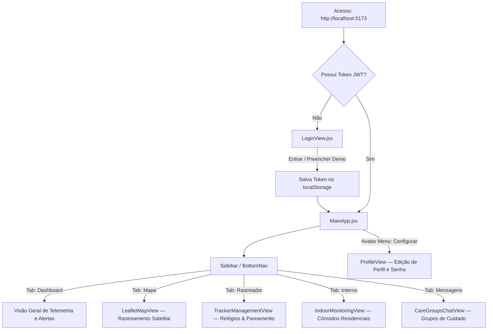

# 🖥️ Betterdays — Front-end Application

Interface web progressiva (**PWA**) construída em **React + Vite**, com design moderno, responsivo e focado em telemetria médica, monitoramento satelital e apoio contínuo a familiares de pacientes com Síndrome de Eisenmenger.

---

## ⚡ Guia Rápido: Como Rodar o Projeto

### 1. Pré-requisitos
* **Node.js**: versão `>= 18.0.0` (recomendado `>= 20.x`)
* **NPM**: versão `>= 9.x`

### 2. Instalação e Execução

```bash
# 1. Entre na pasta do frontend (se estiver na raiz do projeto)
cd frontend

# 2. Instale as dependências
npm install

# 3. Inicie o servidor de desenvolvimento Vite
npm run dev
```

A aplicação estará disponível em: **`http://localhost:5173/`**

> 💡 **Dica:** Para o funcionamento completo dos dados e do chat em tempo real, certifique-se de que o **Back-end** também esteja rodando na porta `8000` (`npm start` na raiz ou `cd backend && npm start`).

---

## 🔑 Credenciais de Teste / Demonstração

Para facilitar o desenvolvimento e testes rápidos, a tela de login conta com o botão **"Preencher Demo"**:

| Campo | Valor |
| --- | --- |
| **E-mail** | `demo@betterdays.com` |
| **Senha** | `password123` |

---

## 🏗️ Arquitetura e Estrutura de Pastas

```
frontend/
├── public/                     # Arquivos estáticos servidos diretamente na raiz (/)
│   ├── manifest.json           # Manifesto PWA (display standalone, atalhos, tema)
│   ├── sw.js                   # Service Worker (Cache Stale-While-Revalidate, Notificações e Offline)
│   ├── favicon.ico             # Favicon clássico desktop
│   ├── favicon.svg             # Favicon vetorial oficial
│   ├── favicon-32x32.png       # Favicon PNG 32px
│   ├── favicon-16x16.png       # Favicon PNG 16px
│   ├── apple-touch-icon.png    # Ícone iOS Safari 180px
│   ├── android-chrome-192x192.png # Ícone Android PWA 192px (any & maskable)
│   ├── android-chrome-512x512.png # Ícone PWA Master 512px (any & maskable)
│   ├── og-image.png            # Mídia para compartilhamento em redes e WhatsApp
│   └── screenshots/            # Capturas de tela para vitrine visual de instalação PWA
│       ├── desktop-preview.png # Vitrine Desktop (1280x720)
│       └── mobile-preview.png  # Vitrine Mobile (540x960)
│
├── src/                        # Código-fonte da aplicação React
│   ├── api/
│   │   └── client.js           # Cliente HTTP REST (autenticação JWT, dispositivos, perfil, fotos)
│   │
│   ├── assets/                 # SVGs e vetores de marca
│   │   ├── logo-icon.svg       # Ícone do monograma Betterdays
│   │   └── logo-text.svg       # Tipografia oficial Betterdays
│   │
│   ├── components/             # Componentes modulares da interface
│   │   ├── LoginView.jsx       # Tela de login e cadastro com floating labels e alternador de tema
│   │   ├── MainApp.jsx         # Orquestrador global de abas, estado e eventos de emergência
│   │   ├── Sidebar.jsx         # Navegação desktop com rodapé de versão e status do sistema
│   │   ├── BottomNav.jsx       # Navegação mobile fixa inferior
│   │   ├── UserAvatarMenu.jsx  # Menu do avatar (Configurar perfil, Instalar PWA, Notificações, Logout)
│   │   ├── LeafletMapView.jsx  # Mapa satelital em tempo real (CartoDB, GPS, rotas e geofences)
│   │   ├── RouteDrawer.jsx     # Painel de rotas de socorro e localização rápida
│   │   ├── TrackerManagementView.jsx # Gestão de relógios inteligentes (pulso/roupa), telemetria e pareamento
│   │   ├── IndoorMonitoringView.jsx # Planta baixa residencial e monitoramento de cômodos
│   │   ├── CareGroupsChatView.jsx # Chat estilo WhatsApp em tempo real (Socket.io, digitação, leitura)
│   │   ├── ProfileView.jsx     # Edição de perfil do usuário, upload de foto, senha e WhatsApp
│   │   ├── NetworkStatusBar.jsx# Barra visual de status de rede (Modo Offline / Reconexão)
│   │   └── AddDeviceModal.jsx  # Modal de cadastro e pareamento de novos rastreadores
│   │
│   ├── hooks/                  # Hooks React reutilizáveis
│   │   ├── useCareSocket.js    # Conexão WebSocket para chat, indicadores de digitação e SOS
│   │   └── useNetworkStatus.js # Monitoramento em tempo real do estado de conexão da internet
│   │
│   ├── services/               # Singletons de infraestrutura do front-end
│   │   ├── socketService.js    # Singleton do cliente Socket.io com reconexão automática
│   │   └── notificationService.js # Gerenciador de notificações nativas do SO (Desktop/Android)
│   │
│   ├── styles/
│   │   └── MainApp.css         # Design System unificado (CSS Grid, Flexbox, Modo Claro/Escuro)
│   │
│   ├── App.jsx                 # Controlador de autenticação (exibe LoginView ou MainApp)
│   └── main.jsx                # Ponto de entrada (DOM render e registro do Service Worker)
│
├── index.html                  # HTML principal com meta tags SEO, PWA e OpenGraph
├── vite.config.js              # Configuração do bundler Vite
└── package.json                # Dependências e scripts do projeto
```

---

## 🧭 Como Funciona a Aplicação

### 1. Fluxo de Autenticação e Navegação


---

### 2. Mensageria em Tempo Real (Socket.io)
* O cliente estabelece conexão WebSocket com `http://localhost:8000/socket.io/`.
* Eventos recebidos e emitidos:
  - `telemetry_pulse`: Atualizações contínuas de coordenadas GPS e nível de bateria.
  - `sos_alert`: Alertas de emergência com coordenadas e disparo de notificação nativa do sistema operacional.
  - `chat_message`: Troca instantânea de mensagens de texto e mídia no Grupo de Cuidado.
  - `typing_status`: Exibe *"Dr. Roberto está digitando..."* em tempo real.

---

### 3. Progressive Web App (PWA) & Offline First
* **Service Worker Ativo (`sw.js`):** Intercepta requisições de rede, pré-carrega os arquivos estáticos (*precache*) e aplica a estratégia *Stale-While-Revalidate*.
* **Instalação:**
  - **No Desktop:** Pelo ícone de instalação do navegador ou pelo botão **"Instalar"** no menu do avatar.
  - **No Android:** Prompt nativo de instalação como aplicativo WebAPK.
  - **No iOS (Safari):** Guia com instruções de *Compartilhar ➔ Adicionar à Tela de Início*.
* **Resiliência Offline:** Ao perder a conexão com a internet, o componente [`NetworkStatusBar.jsx`](file:///Users/vagneribas/Documents/GitHub/tracker_system/frontend/src/components/NetworkStatusBar.jsx) entra em ação informando o modo offline e o uso de dados locais do cache.

---

### 4. Design System & Alternância de Tema (Claro / Escuro)
* O sistema conta com paleta de cores hospitalar suave (Verde Menta, Lavanda, Coral SOS, Âmbar).
* O tema (`light` / `dark`) é aplicado via atributo `data-theme="dark"` no elemento `<html>` e persistido no `localStorage`.
* Para alternar o tema, clique no botão de sol/lua localizado no rodapé da barra lateral ou na tela de login.

---

## 🛠️ Scripts Disponíveis

| Comando | Descrição |
| --- | --- |
| `npm run dev` | Inicia o servidor local de desenvolvimento Vite com Hot Module Replacement (HMR). |
| `npm run build` | Compila e gera o bundle de produção otimizado na pasta `dist/`. |
| `npm run preview` | Executa localmente o bundle de produção gerado na pasta `dist/`. |

---

## 📖 Documentações Relacionadas

* 📄 **[Guia Completo de PWA (`PWA.md`)](../PWA.md)** — Detalhamento técnico do Service Worker, Manifesto e Notificações.
* 📄 **[Arquitetura de Mensageria (`MESSAGING_ARCHITECTURE.md`)](../MESSAGING_ARCHITECTURE.md)** — Dicionário de eventos WebSockets.
* 📄 **[Design System (`DESIGN_SYSTEM.md`)](../DESIGN_SYSTEM.md)** — Tokens de cores, tipografia e componentes.
